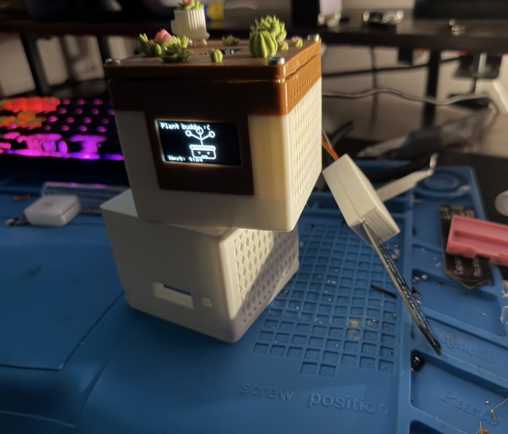
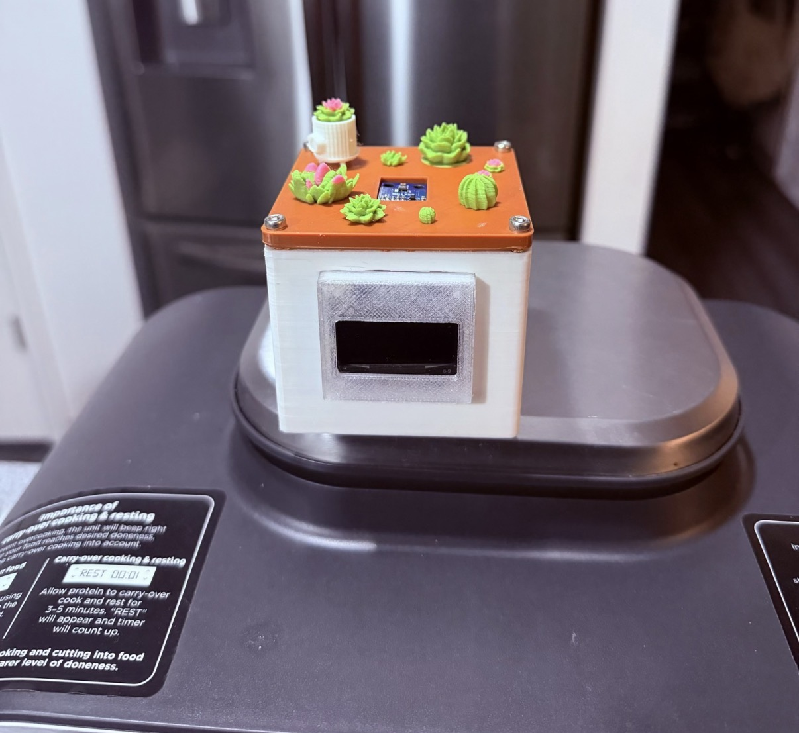
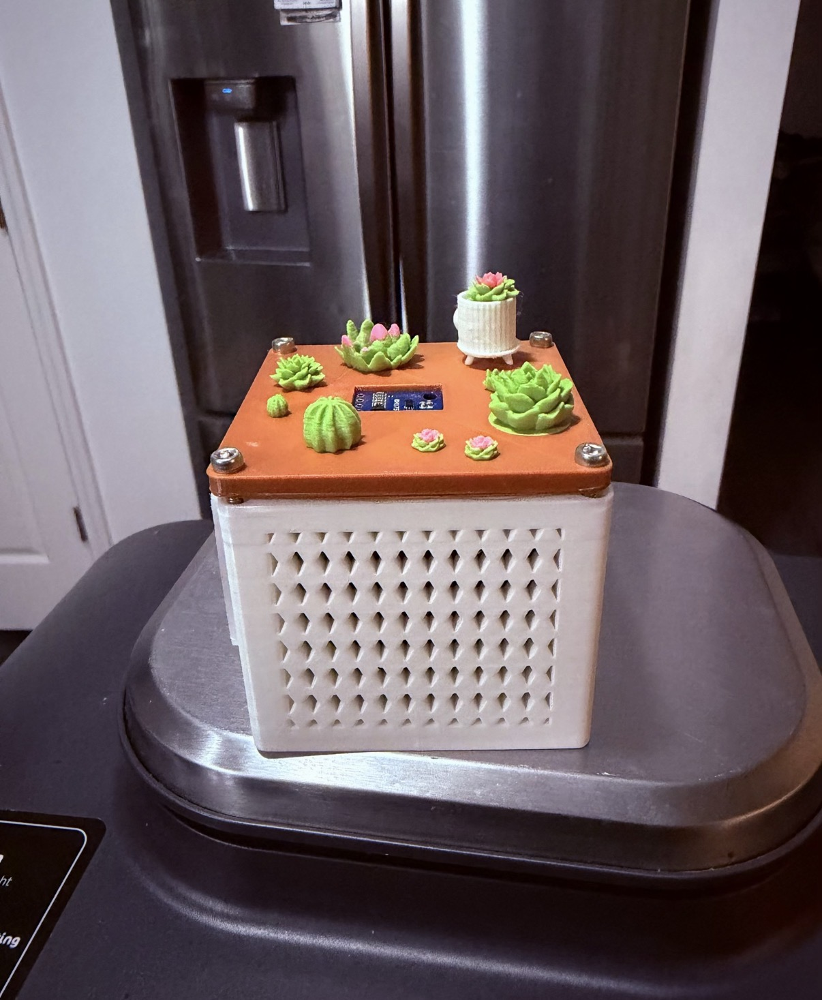

# Plant Monitoring System (ESP32-C3 Mini)

<p align="center">
  
  <br/><br/>
  
  
  <br/>
  <em>Interactive plant monitoring system with multi-sensor feedback and expressive display states</em>
</p>

An interactive plant monitoring system built around an **ESP32-C3 Mini** that helps care for a plant by reading multiple environmental sensors and giving clear, personality-driven feedback.

The device is meant to sit beside a plant with the probe placed in the soil. It monitors plant conditions and tells the user when something is wrong, while also reacting with faces, animations, and messages depending on how well the plant has been cared for.

It can also send alerts using **BLE** and **Telegram-style messaging**.

---

## Features

- **ESP32-C3 Mini** based controller
- **Capacitive soil moisture sensing**
- **Temperature and humidity sensing**
- **Ambient light sensing**
- Adjustable thresholds so the system can be tuned for different plants
- Expressive visual feedback using:
  - happy and sad faces
  - animations when the plant is doing well
  - encouraging messages when care has been consistent
  - occasional quips when the plant is being neglected
- Remote notification capability through **BLE** and **Telegram-style alerts**

---

## How It Works

The monitor is placed next to a plant and powered on while the soil probe is inserted into the potting soil.

The system checks:
- whether the soil is too dry
- whether the plant is too cold
- whether humidity is out of range
- whether the plant is receiving enough light

Instead of only displaying raw numbers, the monitor interprets those readings and responds with animated faces and messages that make the system feel more alive and interactive.

If the plant is healthy for a while, it gives positive feedback. If conditions are poor, it reacts accordingly and lets the caretaker know what needs to be fixed.

---

## Repository Layout

```text
.
├── README.md
├── firmware/
│   └── plant_emotions/
│       └── plant_emotions_code.ino
├── docs/
│   ├── notes/
│   │   ├── indiana_college_core.txt
│   │   └── project_notes.txt
│   └── images/
│       └── wiring_diagram.png
├── mechanical/
│   ├── 1_3_oled_case_cutout_back.stl
│   ├── 1_3_oled_case_front.stl
│   ├── bottom.stl
│   └── lid.stl
├── media/
│   └── images/
│       ├── cover_image_1.jpeg
│       ├── cover_image_2.jpeg
│       └── cover_image_3.jpeg
└── tools/
    └── repo_maintenance/
        └── plant_monitor_repo_audit.py
